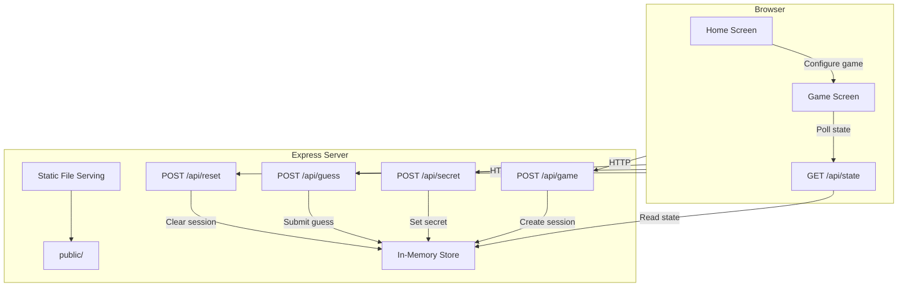

# Design Document: Guess the Number Game

## Overview

A turn-based multiplayer guessing game built with Express.js and vanilla HTML/CSS/JS. One player (the Secret Setter) configures a game session and sets a secret number via the API. Other players (Guessers) take turns submitting guesses through API calls, receiving "too high", "too low", or "correct" feedback. The frontend displays API instructions with the root URL for GitHub Codespaces compatibility. All state is held in memory — no database required.

### Key Design Decisions

- **Single game session**: The server supports one active game at a time, stored in a module-level variable. This keeps the implementation simple.
- **API-driven gameplay**: Setting the secret and submitting guesses happen via REST endpoints. The web UI shows instructions and current state but doesn't submit guesses itself.
- **Root URL detection**: The server reads its own host/port to construct full URLs in API instructions, ensuring compatibility with Codespaces port forwarding.

## Architecture



### Request Flow

1. Player opens the home page, fills in number of guessers and max range, submits → `POST /api/game`
2. Server creates a game session, redirects to game screen
3. Game screen displays API instructions with full URLs for setting secret and guessing
4. Secret Setter calls `POST /api/secret` with the secret number
5. Guessers call `POST /api/guess` with their player number and guess, in turn order
6. Game screen polls `GET /api/state` to refresh display
7. When someone guesses correctly, game is marked complete; UI shows winner and "New Game" button

## Components and Interfaces

### API Endpoints

#### `POST /api/game`
Creates a new game session.

**Request Body:**
```json
{
  "numGuessers": 3,
  "maxNumber": 100
}
```

**Response (201):**
```json
{
  "message": "Game created",
  "numGuessers": 3,
  "maxNumber": 100
}
```

**Error (400):** Invalid or missing parameters.

#### `POST /api/secret`
Sets the secret number for the current game.

**Request Body:**
```json
{
  "secret": 42
}
```

**Response (200):**
```json
{
  "message": "Secret number set. Guessing can begin!"
}
```

**Error (400):** No active game, secret already set, or number out of range.

#### `POST /api/guess`
Submits a guess for the current player's turn.

**Request Body:**
```json
{
  "player": 1,
  "guess": 50
}
```

**Response (200):**
```json
{
  "result": "too_high",
  "player": 1,
  "guess": 50,
  "nextPlayer": 2
}
```

Result values: `"too_high"`, `"too_low"`, `"correct"`.

**Error (400):** No active game, secret not set, wrong player's turn, or guess out of range.

#### `GET /api/state`
Returns the current game state for UI rendering.

**Response (200):**
```json
{
  "active": true,
  "numGuessers": 3,
  "maxNumber": 100,
  "secretSet": true,
  "currentPlayer": 2,
  "guesses": [
    { "player": 1, "guess": 50, "result": "too_high" }
  ],
  "winner": null,
  "totalGuesses": 1
}
```

#### `POST /api/reset`
Clears the current game session so a new game can start.

**Response (200):**
```json
{
  "message": "Game reset"
}
```

### Frontend Pages

| File | Purpose |
|------|---------|
| `public/index.html` | Home screen with game configuration form |
| `public/game.html` | Game screen showing API instructions, state, and guess history |
| `public/style.css` | Shared styles |
| `public/app.js` | Client-side logic: form submission, state polling, UI updates |

### Server Module

| File | Purpose |
|------|---------|
| `server.js` | Express app: routes, validation, in-memory state, static serving |

## Data Models

### GameSession (in-memory object)

```javascript
{
  numGuessers: Number,    // count of guessing players (≥ 1)
  maxNumber: Number,      // upper bound of range (≥ 1), range is [1, maxNumber]
  secret: Number | null,  // the secret number, null until set
  currentPlayer: Number,  // 1-indexed, which guesser's turn it is
  guesses: [              // ordered history of all guesses
    {
      player: Number,     // which guesser made this guess
      guess: Number,      // the guessed value
      result: String      // "too_high" | "too_low" | "correct"
    }
  ],
  winner: Number | null,  // player number who guessed correctly, null if ongoing
  complete: Boolean       // true when someone guesses correctly
}
```

### Validation Rules

| Field | Rule |
|-------|------|
| `numGuessers` | Integer ≥ 1 |
| `maxNumber` | Integer ≥ 1 |
| `secret` | Integer in [1, maxNumber] |
| `guess` | Integer in [1, maxNumber] |
| `player` | Integer in [1, numGuessers], must match `currentPlayer` |


## Correctness Properties

*A property is a characteristic or behavior that should hold true across all valid executions of a system — essentially, a formal statement about what the system should do. Properties serve as the bridge between human-readable specifications and machine-verifiable correctness guarantees.*

### Property 1: Game creation round trip

*For any* valid configuration (numGuessers ≥ 1, maxNumber ≥ 1), creating a game via `POST /api/game` and then reading state via `GET /api/state` should return a session with matching numGuessers and maxNumber, secretSet false, currentPlayer 1, empty guesses, and no winner.

**Validates: Requirements 1.4, 1.5**

### Property 2: Secret setting round trip

*For any* active game session and any integer in [1, maxNumber], setting it as the secret via `POST /api/secret` and then reading state via `GET /api/state` should show secretSet as true.

**Validates: Requirements 2.2, 2.5**

### Property 3: Secret range validation

*For any* active game session with a given maxNumber, attempting to set a secret that is less than 1 or greater than maxNumber via `POST /api/secret` should return HTTP 400 and leave the session unchanged.

**Validates: Requirements 2.3, 2.4**

### Property 4: Guess feedback correctness

*For any* active game with a secret number set, and any valid guess submitted by the correct player, the response result should be `"too_high"` if guess > secret, `"too_low"` if guess < secret, or `"correct"` if guess == secret.

**Validates: Requirements 3.8**

### Property 5: Turn enforcement

*For any* active game with a secret set and N guessers, submitting a guess with a player number that does not match the current player's turn should return HTTP 400 and leave the game state unchanged.

**Validates: Requirements 3.3, 3.4**

### Property 6: Guess range validation

*For any* active game with a secret set and a given maxNumber, submitting a guess less than 1 or greater than maxNumber (even from the correct player) should return HTTP 400 and leave the game state unchanged.

**Validates: Requirements 3.5, 3.6**

### Property 7: Turn rotation

*For any* active game with N guessers and a secret set, after a valid (non-winning) guess by player K, the next player's turn should be `(K % N) + 1`.

**Validates: Requirements 3.7**

### Property 8: Correct guess completes game

*For any* active game with a secret set, when a player submits a guess equal to the secret number, the game should be marked complete with that player recorded as the winner.

**Validates: Requirements 7.1, 7.2**

### Property 9: Guess history completeness

*For any* sequence of valid guesses submitted to an active game, the guess history returned by `GET /api/state` should contain all submitted guesses in order, and totalGuesses should equal the length of the guess history.

**Validates: Requirements 5.4, 7.3**

## Error Handling

| Scenario | Endpoint | HTTP Status | Response |
|----------|----------|-------------|----------|
| Missing or invalid numGuessers/maxNumber | `POST /api/game` | 400 | `{ "error": "numGuessers and maxNumber must be positive integers" }` |
| No active game | `POST /api/secret`, `POST /api/guess`, `GET /api/state` | 400 | `{ "error": "No active game" }` |
| Secret already set | `POST /api/secret` | 400 | `{ "error": "Secret already set" }` |
| Secret out of range | `POST /api/secret` | 400 | `{ "error": "Secret must be between 1 and {maxNumber}" }` |
| Secret not yet set | `POST /api/guess` | 400 | `{ "error": "Secret not set yet" }` |
| Wrong player's turn | `POST /api/guess` | 400 | `{ "error": "It is player {currentPlayer}'s turn" }` |
| Guess out of range | `POST /api/guess` | 400 | `{ "error": "Guess must be between 1 and {maxNumber}" }` |
| Game already complete | `POST /api/guess` | 400 | `{ "error": "Game is already complete" }` |

All error responses use a consistent `{ "error": "..." }` JSON shape. The server uses `express.json()` middleware and returns 400 for any malformed JSON body.

## Testing Strategy

### Unit Tests

Unit tests cover specific examples, edge cases, and integration points:

- Creating a game with valid parameters returns 201 and correct state
- Setting a secret at the boundary values (1 and maxNumber) succeeds
- Submitting a guess when no game exists returns 400
- Submitting a guess when secret is not set returns 400
- Game completion flow: create → set secret → guess correctly → verify winner
- Reset clears all state
- Static files are served correctly (index.html, game.html, style.css, app.js)

Use `supertest` for HTTP-level testing of the Express app.

### Property-Based Tests

Use `fast-check` as the property-based testing library. Each property test runs a minimum of 100 iterations.

Each test must be tagged with a comment referencing the design property:

```
// Feature: guess-the-number-game, Property 1: Game creation round trip
```

Properties to implement:

1. **Property 1** — Game creation round trip: generate random valid configs, create game, verify state matches.
2. **Property 2** — Secret setting round trip: generate random valid secrets within range, set and verify.
3. **Property 3** — Secret range validation: generate random out-of-range secrets, verify 400 response.
4. **Property 4** — Guess feedback correctness: generate random secrets and guesses, verify feedback matches comparison.
5. **Property 5** — Turn enforcement: generate random wrong-player guesses, verify 400 response.
6. **Property 6** — Guess range validation: generate random out-of-range guesses, verify 400 response.
7. **Property 7** — Turn rotation: generate sequences of valid guesses, verify turn advances correctly.
8. **Property 8** — Correct guess completes game: generate random games, submit the correct guess, verify completion.
9. **Property 9** — Guess history completeness: generate random guess sequences, verify history length and order.

### Test File Structure

```
tests/
  unit.test.js        # Unit tests with supertest
  properties.test.js  # Property-based tests with fast-check
```

### Dependencies

```json
{
  "devDependencies": {
    "jest": "^29.0.0",
    "supertest": "^6.0.0",
    "fast-check": "^3.0.0"
  }
}
```
